## Part 1. Настройка gitlab-runner

- Поднимем ВМ, установим и зарегистрируем на ней gitlab-runner в docker

```shell
docker run --rm -it \
  -v /srv/gitlab-runner/config:/etc/gitlab-runner \
  gitlab/gitlab-runner:latest \
  register \
  --non-interactive \
  --executor "docker" \
  --docker-image alpine:latest \
  --url "https://git.21-school.ru" \
  --registration-token "GR1348941w5PpxixsanwZ3efJxRiu" \
  --description "docker-runner" \
  --tag-list "docker,linux" \
  --run-untagged="true" \
  --locked="false"
```
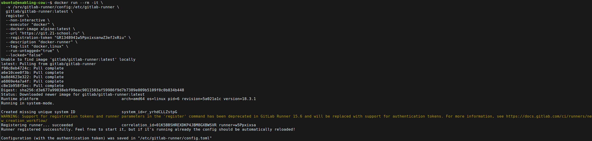

- Запустим gitlab-runner

```shell
docker run -d --name gitlab-runner --restart always \
  -v /var/run/docker.sock:/var/run/docker.sock \
  -v /srv/gitlab-runner/config:/etc/gitlab-runner \
  gitlab/gitlab-runner:latest
```
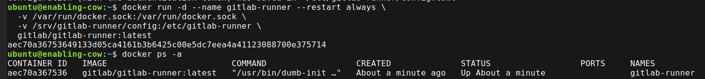

- Проверим конфиг

```shell
ls -la /srv/gitlab-runner/config/
```
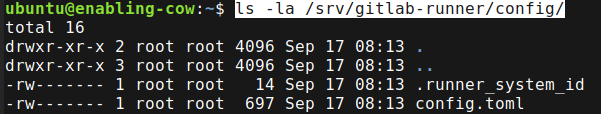

```shell
sudo cat /srv/gitlab-runner/config/config.toml
```
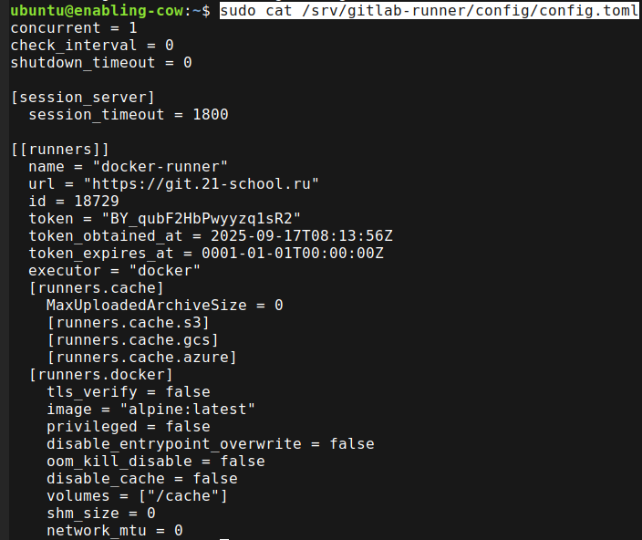

- Можно проверить логи

```shell
docker logs -f gitlab-runner
```


## Part 2. Сборка

- Сборка прошла успешно, артефакт доступен к загрузке \
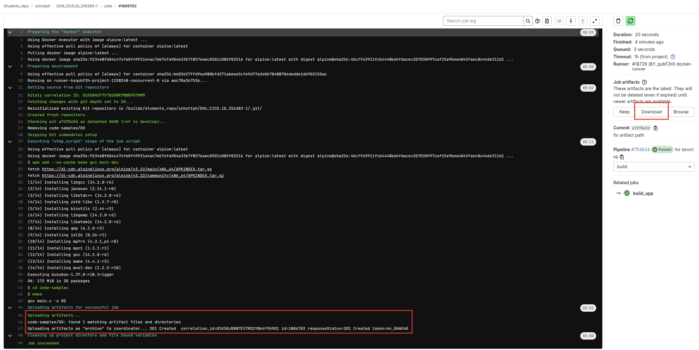


## Part 3. Тест кодстайла

- После запуска джобы Clang-format нашел и отобразил нарушения кодстайла и зафейлил пайплайн \
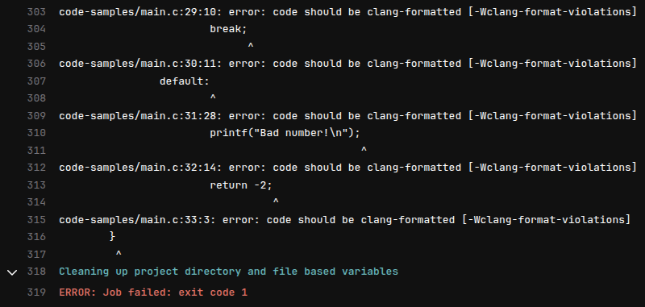 \
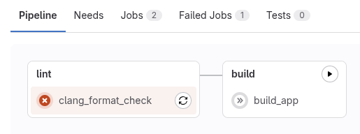


## Part 4. Integration tests

- Результаты интеграционных тестов можно увидеть в джобе \
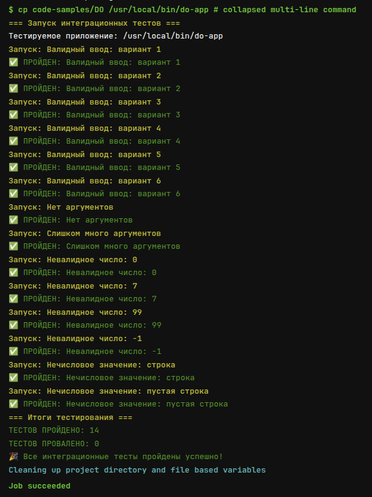


## Part 5. Deployment stage

- Пайплайн отработал корректно \
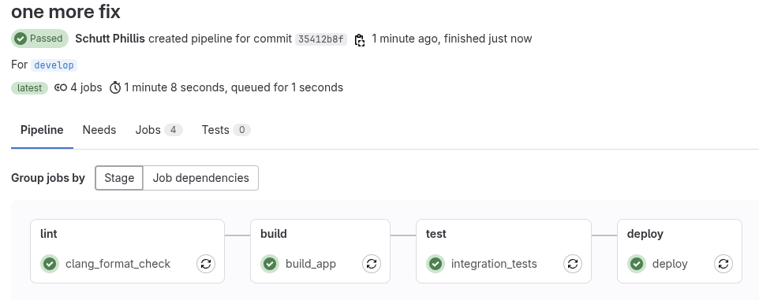

- Проверим логи окончания выполнения джобы \
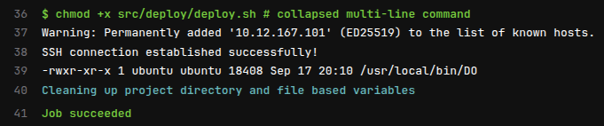

- Проверим целевую директорию на второй ВМ до и после запуска пайплайна \
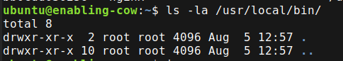 \
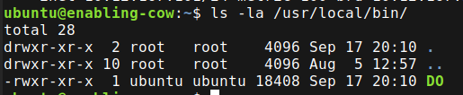


## Part 6. Bonus. Notifications

- Создаём бота, отправив `/newbot` в `@BotFather` \
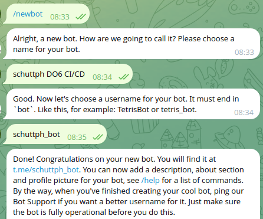

- Бот отрабатывает сообщение по каждой джобе пайплайна \
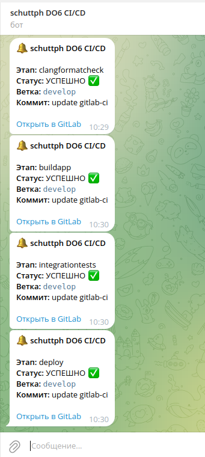
